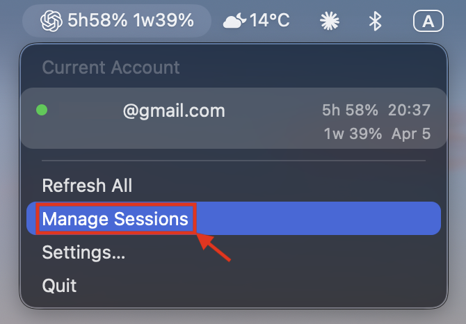

English | [中文](README.zh-CN.md)

# Codex Quota Viewer

A native macOS menu bar app for checking Codex quota and managing local Codex
sessions without touching the terminal.

Codex Quota Viewer is built for people who want two things in one place:

- fast visibility into the Codex account currently active on the machine
- a practical way to browse, restore, archive, and repair local Codex sessions

It stays lightweight, runs from the menu bar, and bundles the session manager
inside the app so end users do not need a separate CodexMM checkout, a manual
Node setup, or a local server command.

## Why Codex Quota Viewer

- **Menu bar first**: check Codex status without keeping a full desktop app
  open
- **Quota visibility**: see short-window and weekly usage for the current Codex
  login
- **Multi-account awareness**: compare the current account with CC Switch
  accounts stored on the same Mac
- **Built-in session management**: open a local web console for Codex sessions
  straight from the menu bar
- **No extra session-manager install**: `CodexQuotaViewer.app` bundles the
  session manager and its private runtime

## What’s New in 0.3.0

- add sessions manager
- fixes incomplete English session-manager localization so official sync
  summaries, issue lists, timeline role labels, audit actions, and known
  validation errors switch cleanly with the UI language
- For a lightweight experience without session management, download v0.1.0—a standalone version dedicated solely to monitoring your Codex quota.



## What You Can Do

### Quota Viewer

Use the menu bar app to:

- inspect the Codex account currently represented by `~/.codex/auth.json`
- see `5h` and `1w` quota windows for standard Codex logins
- detect API-key-based profiles and show provider metadata when quota data is
  unavailable
- compare additional Codex accounts discovered from CC Switch
- refresh account data on demand
- switch the menu bar display between a compact meter and a text summary


### Session Manager

Use **Manage Sessions** to open a bundled local web console where you can:

- browse sessions grouped by project directory
- filter sessions by `Active`, `Archived`, and `Trash`
- search by session title, path, and excerpts
- inspect summaries, timestamps, line counts, event counts, and tool calls
- read the full thread timeline
- restore a session to a Codex-recognized location
- choose between **Resume only** and **Rebind cwd** restore modes
- archive the currently selected session
- move sessions to trash, restore them, and empty trash
- batch-select sessions and run archive, trash, restore, and purge actions
- repair official Codex thread metadata when local thread visibility drifts

## Session Manager

The bundled session manager is the feature that turns Codex Quota Viewer from a
quota-only utility into a full local Codex desktop companion.

From the menu bar, click **Manage Sessions**. The app then:

- checks whether the local session manager is already healthy on
  `http://127.0.0.1:4318`
- reuses the running service when it already exists
- otherwise starts the bundled service from inside `CodexQuotaViewer.app`
- opens the web console in your default browser once the health check succeeds

This web console is local-only. It serves on `127.0.0.1`, manages local
`~/.codex` session files, and does not require you to install CodexMM or Node
separately.


### Typical workflow

1. Open `CodexQuotaViewer.app` and click the menu bar item.
2. Choose **Manage Sessions**.
3. Pick a project from the left sidebar.
4. Select the session you want to inspect.
5. Review the summary cards, timeline, and official sync status.
6. Choose **Resume only** if you want to keep the original binding, or
   **Rebind cwd** if you want the session to point at a new working directory.
7. Use **Restore to directory**, **Archive current**, **Repair this thread**,
   or the batch actions depending on the job you need done.

### What the restore modes mean

- **Resume only**: restore the session so Codex can recognize it again without
  changing its working-directory binding
- **Rebind cwd**: restore the session and permanently point it at a different
  project directory

### What “Repair official threads” is for

If a local session no longer appears correctly in official Codex thread state
or recent-conversation metadata, the repair actions can rebuild that linkage
from your local session data. This is useful when a session exists on disk but
has drifted out of sync with the official local thread index.

## Quick Start

### Install the packaged app

1. Download the latest DMG from the
   [Releases](https://github.com/Half-Melon/Codex-Quota-Viewer/releases) page.
2. Drag `CodexQuotaViewer.app` into `/Applications`.
3. Open the app and allow it through macOS if Gatekeeper asks for confirmation.
4. Click the new menu bar item to see your current Codex account and quota.

### Start using session management

1. Open the menu bar item.
2. Click **Manage Sessions**.
3. Wait for the browser page to open if the bundled service needs to start.
4. Manage sessions from the local web console.

## How Session Management Works

The session manager ships inside the packaged app at:

```text
CodexQuotaViewer.app/Contents/Resources/SessionManager/
```

That bundled directory contains everything needed to run the local web console:

- the vendored CodexMM production build
- production `node_modules`
- a private Node runtime copied into the app during packaging

For end users, the important part is simple:

- the packaged `.app` is the distribution unit
- you do not need to clone CodexMM
- you do not need to install Node just to use **Manage Sessions**
- the browser UI is still a local web app, not an embedded native long list

## Requirements

- macOS 13 or later
- A working local Codex installation:
  - `Codex.app` in `/Applications`, or
  - the `codex` CLI available in your shell `PATH`
- A signed-in Codex profile in `~/.codex/auth.json`

Optional:

- CC Switch with a local database at `~/.cc-switch/cc-switch.db`

## Privacy and Local Data

Codex Quota Viewer is designed for local desktop use. It reads data that is
already on your machine and does not ask you to paste credentials into the UI.

The app may read these local sources when available:

- `~/.codex/auth.json`
- `~/.codex/config.toml`
- `~/.cc-switch/cc-switch.db`
- `~/.codex/sessions/**/*.jsonl`
- `~/.codex/archived_sessions/**/*.jsonl`

For quota reading, the app talks to your local Codex installation in
`app-server` mode.

For session management:

- the bundled service reads local `~/.codex` session files
- local index, snapshot, and audit data remain in `~/.codex-session-manager`
- the web UI is only served on `127.0.0.1`

The session manager screenshot included in this README is a privacy-safe export
derived from a real UI capture. Local path fragments and metadata were removed
before it was added to the repository.

## Troubleshooting

### “Could not find the codex executable.”

Make sure that:

- `Codex.app` is installed in `/Applications`, or
- `codex` is installed and available in your shell `PATH`

### “Sign in required.”

Your current Codex session is missing, invalid, or expired. Sign in again with
Codex and confirm that `~/.codex/auth.json` exists and is current.

### “Timed out while reading quota.”

The local Codex process did not return account data in time. Try **Refresh
All** again. If the problem continues, verify that Codex itself can run
normally on the machine.

### “Launch at login can only be configured when running from the app bundle.”

Launch at login only works when the app is started from the packaged `.app`.
It does not work when running the executable directly from a Swift build
output.

### “Bundled session manager is missing. Rebuild CodexQuotaViewer.app.”

This means the app was launched without the packaged `SessionManager`
resources, or the bundle contents are incomplete. Rebuild the app with:

```bash
./scripts/build-app.sh
```

Then launch `dist/CodexQuotaViewer.app`, not just the bare executable.

### “Session manager could not start because port 4318 is already in use.”

Another local process is already listening on port `4318`. If it is an
existing session manager instance, Codex Quota Viewer can reuse it. If it is
unrelated, stop it before using **Manage Sessions** from the app.

### “Failed to read CC Switch data.”

Check that:

- CC Switch is installed
- `~/.cc-switch/cc-switch.db` exists
- `/usr/bin/sqlite3` is available on your system

If one of these is missing, Codex Quota Viewer can still show the current
Codex account, but it will not list CC Switch accounts.

## Build from Source

To build the full packaged app, run:

```bash
./scripts/build-app.sh
```

This builds the native Swift menu bar app and the bundled session manager in
one pass, producing:

```text
dist/CodexQuotaViewer.app
```

To build only the standalone executable, run:

```bash
swift build -c release --product CodexQuotaViewer
```

This is useful for native app development, but it does **not** include the
bundled session manager resources. Use `./scripts/build-app.sh` for the
distributable app bundle.

## Updating Vendored CodexMM

The bundled session manager source lives in:

```text
Vendor/CodexMM
```

For the current snapshot metadata and the recommended sync workflow, see:

```text
Vendor/CodexMM/VENDORED.md
```

The intended update path is an in-place overwrite of the vendored directory
while preserving the upstream repository layout:

```bash
rsync -a --delete \
  --exclude '.git' \
  --exclude 'node_modules' \
  --exclude 'dist' \
  --exclude '.DS_Store' \
  /path/to/CodexMM/ Vendor/CodexMM/
```

After syncing, rebuild the packaged app and rerun the relevant checks before
shipping.

## Distribution note

The current DMG is a preview build for testing. It is not notarized for broad
consumer distribution, and macOS may require manual approval on first launch.

The bundled private Node runtime is copied from the build machine's local Node
installation. Its CPU architecture therefore follows the build machine, and
this project still needs proper release engineering before broad distribution.

## Acknowledgements

This project integrates with local profile data managed by
[CC Switch](https://github.com/farion1231/cc-switch) to make multi-account
Codex usage more practical.

Special thanks to the CC Switch project for reducing the friction of local
account switching and profile management. Codex Quota Viewer benefits directly
from that workflow and ecosystem.

## Community Thanks

Thank you to the [LinuxDo](https://linux.do) community for your support.

LinuxDo is a welcoming place for tech discussions, AI frontiers, and practical
AI experience sharing. Communities like it help tools such as Codex Quota
Viewer become more useful, more understandable, and easier to improve.
