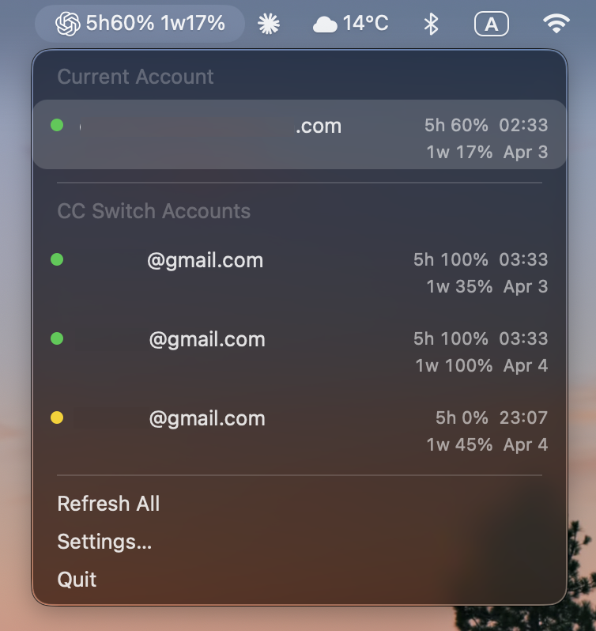
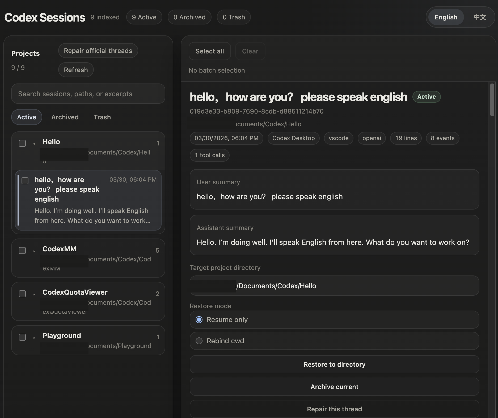

[English](README.md) | 中文

# Codex Quota Viewer

> 当前正式版：`1.0.0`

Codex Quota Viewer 是一个原生 macOS 菜单栏应用。它把 Codex 用户最常做的几件
事放到一个入口里：看当前额度、管理多个账号、安全切换账号、浏览和修复本地会话。

你不用自己去翻 `~/.codex`，也不用手动改 `auth.json`、`config.toml`，更不用为了
看会话再单独装一套 Session Manager。打开菜单栏图标，大多数日常操作都能直接做。

## 1.0.0 版能做什么

- 查看当前 Codex 账号，并直接看到 `5h` / `1w` 剩余额度。
- 管理多个 ChatGPT 账号和 API 账号。
- 用应用内置流程新增 ChatGPT 账号。
- 通过 API Key + Base URL 新增 OpenAI-compatible API 账号，并在可用时自动探测模型。
- 安全切换账号，自动备份、修复线程状态，并支持一键回滚。
- 从菜单栏直接打开内置 Session Manager，在浏览器里管理本地会话。
- 浏览、搜索、恢复、归档、回收、批量处理会话。
- 一次设置中英文语言，原生界面和 Session Manager 一起切换。
- 在设置里调整刷新频率、菜单栏显示样式、开机启动等常用选项。

## 这款程序适合谁

如果你有下面这些需求，这个程序基本就是为你准备的：

- 你经常想确认“我现在这个 Codex 账号还有多少额度”。
- 你会在多个 Codex 身份之间切换，但不想手改配置文件。
- 你想找回旧会话、恢复会话、清理会话，最好别敲命令。
- 你希望拿到的是一个能直接打开的 `.app`，不是一堆脚本。

## 截图





## 快速开始

### 安装

1. 到 [Releases](https://github.com/Half-Melon/Codex-Quota-Viewer/releases) 页面下载最新 DMG。
2. 把 `CodexQuotaViewer.app` 拖进 `/Applications`。
3. 双击打开；如果 macOS 提示来源不明，按系统提示手动放行。
4. 点击菜单栏里的新图标。

### 第一次使用

1. 先让程序读取你当前的 `~/.codex/auth.json`。
2. 如果你要保存更多账号，打开 **Settings... -> Accounts**。
3. 如果你要管理旧会话，打开 **Maintenance -> Open Session Manager**。
4. 如果你要切换到别的账号，使用 **Switch Safely**。

## 主要功能

### 1. 菜单栏直接看额度

这部分就是最直接的“抬头就能看”的体验。

- 标准 Codex 登录会显示 `5h` 和 `1w` 两个窗口。
- 只有周额度的账号，也会按周额度正确显示。
- 菜单栏可以切成仪表样式，也可以切成文字样式。
- 可以手动刷新，也可以按设定频率自动刷新。
- 数据如果变旧了，会明确提示你它可能已经过期。

### 2. 本地账号仓

程序内建了自己的本地账号仓，用来保存你想长期管理的账号。

- 保存多个 ChatGPT 账号。
- 保存多个 API 账号。
- 在 **Settings... -> Accounts** 里重命名、激活、忘记账号。
- 一键打开本地账号仓目录。
- 菜单顶部保持简洁，完整账号列表收进 **All Accounts**。
- 如果本机存在兼容的旧账号数据，程序可以做一次性导入。
- 菜单会尽量把更值得优先看的账号排在前面，同时完整分组列表仍然保留在 **All Accounts** 里。

### 3. 安全切换账号

这是本程序最核心的能力之一。

点击 **Switch Safely** 后，程序会尽量按安全流程帮你完成切换：

- 先关闭 Codex
- 创建 restore point 备份
- 写入目标 `auth.json`
- 合并并写入目标 `config.toml`
- 必要时重写 rollout 的 `model_provider`
- 修复本地官方线程状态
- 最后重新打开 Codex

如果切完发现不对，可以直接用 **Maintenance -> Rollback Last Change** 回退最近一次切换。

切换备份默认保存在：

```text
~/Library/Application Support/CodexQuotaViewer/SwitchBackups/
```

### 4. 内置 Session Manager

你可以从 **Maintenance -> Open Session Manager** 直接打开内置会话管理器。它会在
本机 `127.0.0.1:4318` 启动一个本地 Web 管理台。

你可以在里面：

- 按项目目录浏览会话
- 按 `Active`、`Archived`、`Trash` 筛选
- 按标题、路径、摘要搜索会话
- 查看摘要、时间、行数、事件数、工具调用数
- 阅读完整时间线
- 恢复会话
- 在 `Resume only` 和 `Rebind cwd` 两种恢复模式之间选择
- 归档、移入回收站、恢复、彻底清理
- 批量选择多条会话一起操作
- 修复官方本地线程元数据漂移

重点是：它已经打包进 `.app` 里了。最终用户不需要再单独安装 CodexMM，也不需要自己装 Node。

### 5. Maintenance 工具集中入口

当本地状态有点乱、或者你只是想手动处理问题时，**Maintenance** 里集中放了最常用的几个入口：

- **Refresh All**
- **Open Session Manager**
- **Repair Now**
- **Rollback Last Change**

### 6. 一套语言设置，全局生效

程序和 Session Manager 共用同一套语言设置：

- `Follow System`
- `English`
- `中文`

你只需要在 **Settings... -> General -> Language** 改一次。

### 7. 真正常用的设置项

当前版本的设置项不是摆设，都是日常会用到的：

- 刷新频率
- 开机启动
- 菜单栏显示样式
- 语言
- 账号管理

## 常见使用路径

### 我只想看当前额度

1. 打开程序。
2. 看菜单栏或点开菜单。
3. 如果觉得数据可能旧了，点 **Refresh All**。

### 我想新增一个账号

1. 打开 **Settings... -> Accounts**。
2. 选择 **Sign in with ChatGPT** 或 **Add API Account**。
3. 保存账号。
4. 需要使用时，再从菜单里选中它。

### 我想安全切换账号

1. 在顶部账号行或 **All Accounts** 里选中目标账号。
2. 点击 **Switch Safely**。
3. 等程序完成备份、写配置、修复线程和重开 Codex。
4. 如需撤销，点 **Rollback Last Change**。

### 我想找回或恢复旧会话

1. 打开 **Maintenance -> Open Session Manager**。
2. 找到项目和会话。
3. 如果只是想让 Codex 重新识别它，用 `Resume only`。
4. 如果还想改会话绑定的工作目录，用 `Rebind cwd`。

## 隐私与本地数据

这个程序是按“本地桌面工具”设计的。

- 它读取的是你机器上已经存在的本地 Codex 数据。
- 如果你主动新增 API 账号，凭据会保存在应用自己的本地账号仓里。
- Session Manager 只监听 `127.0.0.1`。
- 会话文件不会被自动上传到外部服务。

程序常见会接触到这些本地路径：

- `~/.codex/auth.json`
- `~/.codex/config.toml`
- `~/.codex/sessions/**/*.jsonl`
- `~/.codex/archived_sessions/**/*.jsonl`
- `~/Library/Application Support/CodexQuotaViewer/Accounts/**/*`
- `~/Library/Application Support/CodexQuotaViewer/SwitchBackups/**/*`

本仓库里的截图已经做过隐私安全处理。

## 系统要求

- macOS 13 或更高版本
- 本机可用的 Codex 安装：
  `Codex.app` 在 `/Applications`，或者 shell `PATH` 中有 `codex`
- 已登录的 Codex 配置：`~/.codex/auth.json`

## 从源码构建

如果你要构建完整的打包应用：

```bash
./scripts/build-app.sh
```

产物在：

```text
dist/CodexQuotaViewer.app
```

如果你只想构建原生可执行文件：

```bash
swift build -c release --product CodexQuotaViewer
```

如果你要跑项目验证：

```bash
./scripts/verify-all.sh
```

## 故障排查

### “Could not find the codex executable.”

确认以下任一条件成立：

- `/Applications` 里存在 `Codex.app`
- shell `PATH` 中可以直接找到 `codex`

### “Sign in required.”

说明当前本地 Codex 登录缺失、过期或无效。请重新登录，并确认 `~/.codex/auth.json`
确实存在。

### “Timed out while reading quota.”

说明本地 Codex 运行时没有及时返回额度信息。先重试 **Refresh All**；如果一直失败，
先确认 Codex 本身在这台机器上是可用的。

### “Bundled session manager is missing. Rebuild CodexQuotaViewer.app.”

请重新构建打包应用：

```bash
./scripts/build-app.sh
```

然后从 `dist/` 目录里打开完整的 `.app`，不要只运行 Swift 裸可执行文件。

### “Session manager could not start because port 4318 is already in use.”

说明有别的进程占用了 `4318` 端口。如果那就是已经运行的会话管理器，程序可以复用；
如果不是，请先停止它，再重试。

## 分发说明

打包后的 `.app` 内已经包含：

- 原生 Swift 菜单栏应用
- 内置 Session Manager 的应用文件
- 供 Session Manager 使用的私有 Node runtime

所以最终分发单位就是这个 `.app`。普通用户不需要再去单独准备一套 Web 端会话管理器环境。

## 致谢

感谢 [LinuxDo](https://linux.do/) 社区的支持。
